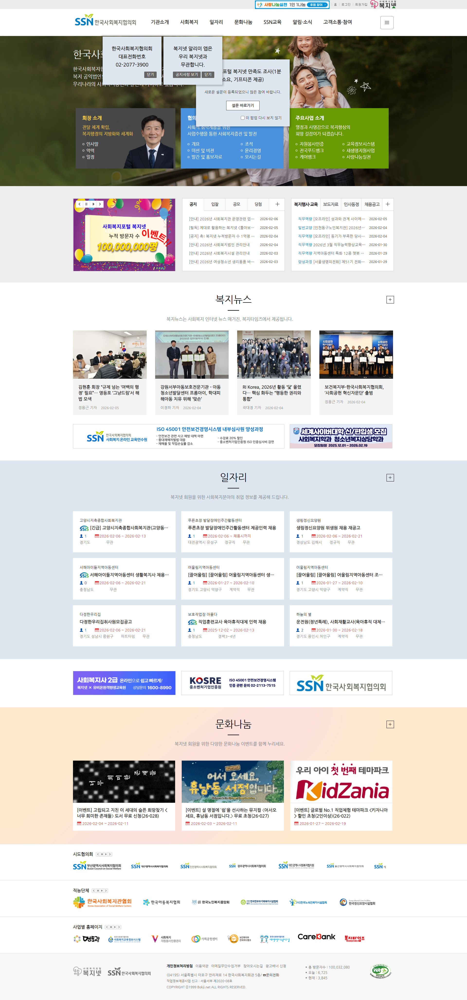
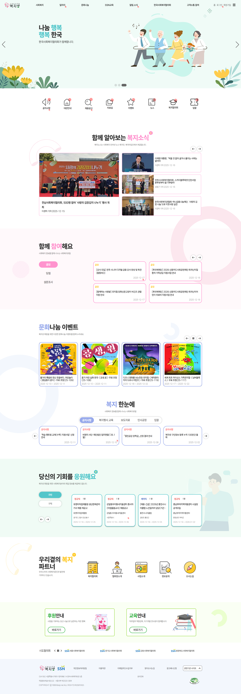
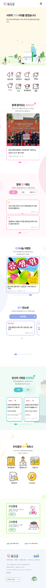

# 복지정보 통합 플랫폼 
> **사용자 중심의 구인·구직 정보와 복지 소식을 제공하는 사이트**

---

## Link
-리뉴얼 전 페이지 (web-site) https://www.bokji.net/ <br><br>
-바로가기 (web-site) https://baragi1212.github.io/bokjinet-re/ <br>
-기획서 (figma) https://www.figma.com/design/dpyMRV8t9UDlRsmap3Prr7/%EB%B3%B5%EC%A7%80%EB%84%B7%EB%A6%AC%EB%89%B4%EC%96%BC-%EB%B0%95%EC%83%81%EA%B1%B4?node-id=1209-773&t=JAfrumycc44ZeTHk-1 <br>
-디자인 시안 (figma) https://www.figma.com/design/dpyMRV8t9UDlRsmap3Prr7/%EB%B3%B5%EC%A7%80%EB%84%B7%EB%A6%AC%EB%89%B4%EC%96%BC-%EB%B0%95%EC%83%81%EA%B1%B4?node-id=130-2379&t=JAfrumycc44ZeTHk-1 <br>

## 프로젝트 미리보기
| 리뉴얼 전 페이지 |
| :---: |
|  |

| 메인 페이지 (PC) | 반응형 (Mobile) |
| :---: | :---: |
|  |  |


---
## Tech Stack
- **Frontend:** HTML5, CSS3, JavaScript
- **Libraries:** Swiper.js (슬라이더), AOS.js (스크롤 애니메이션), Font Awesome (아이콘)
- **Design & Planning:** Figma

---
---
## 주요 해결 과제

###  탭 전환 시 슬라이드 깨짐 현상 해결
* **문제:** 히든 처리된 탭 내의 Swiper 슬라이드가 활성화될 때 크기를 제대로 계산하지 못해 레이아웃이 깨지는 현상 발생.
* **해결:** 탭 클릭 이벤트 발생 시 `swiper.update()`와 `swiper.slideTo(0)`를 호출하여, 슬라이더가 렌더링되는 시점에 크기를 재계산하도록 로직을 보완했습니다.

---
---


## 주요 개선 및 기능

### 구인 · 구직 파트 이원화
* **선택적 노출:** 한 화면에 섞여 있던 구인/구직 정보를 상단 탭으로 분리하여 사용자가 원하는 정보만 골라볼 수 있습니다.
* **슬라이드 인터랙션:** 수직 나열 방식에서 벗어나 넘겨가며 볼 수 있는 슬라이드 형식을 도입해 정보 밀도를 최적화했습니다.

### 콘텐츠 집중도 및 완성도 향상
* **불필요 요소 제거:** 제작 중이거나 미사용 중인 빈 영역을 보이지 않게 처리하여 사이트의 마감 상태를 높였습니다.
* **맥락 중심 재배치:** 복지 뉴스 및 문화나눔 페이지 하단에 있던 관련 없는 콘텐츠를 삭제하여 정보 탐색의 흐름을 개선했습니다.

### 시각적 정보 결합
* **포스터 큐레이션:** 단순 텍스트가 아닌 메인 페이지의 포스터와 상세 정보를 결합하여 시각적 전달력을 극대화했습니다.

### 푸터(Footer) 최적화
* **관련 사이트 정리:** 기존의 어지러웠던 3줄 구성을 1줄로 정렬하였습니다

---

---
## 주요 기능 구현

* **통합 페이지네이션 시스템:** `setupNoticePagination` 함수를 모듈화하여 여러 컨테이너(`#main1~7`)에 독립적인 페이징과 검색 로직을 일괄 적용, 코드 재사용성을 극대화했습니다.
* **실시간 검색 및 필터링:** 제목 기반 키워드 검색과 다중 조건(지역, 시설, 경력 등) 필터링을 결합하여 새로고침 없는 데이터 탐색 환경을 구축했습니다.
* **정렬 시스템:** 등록순/마감순 등 동적 정렬 기능을 구현했습니다.

* **쿠키 기반 팝업 제어:** `document.cookie`를 활용한 '오늘 하루 보지 않기' 로직으로 사용자 피로도를 최소화했습니다.
* **반응형 적응형 UI:** - **Header:** 스크롤 위치에 따라 스타일이 변하는 다이나믹 헤더.
  - **Menu:** 모바일 환경에 최적화된 아코디언 메뉴 및 스마트 오버레이 시스템.
  - **Tabs:** 모바일 화면에서 일반 탭이 **커스텀 셀렉트 박스**로 자동 전환되는 적응형 UI 구현.

* **Swiper SDK 활용:** 메인 비주얼, 복지 뉴스, 일자리 등 섹션별 특성에 맞춘 슬라이드를 구현하고, 탭 전환 시 `update()` 로직을 통해 레이아웃 깨짐을 방지했습니다.
* **웹 접근성(A11y) 강화:** 스크린 리더와 키보드 사용자를 위한 접근성 메시지 및 컨트롤 기능을 포함했습니다.
* **조건부 렌더링:** 데이터 값(정규직/계약직 등)을 감지하여 폰트 색상을 자동 변경하는 등 정보 가시성을 높였습니다.

---
---

## 파일 구조 (Project Structure)
각 페이지의 독립성을 유지하면서도 공통 스타일을 효율적으로 관리하도록 설계되었습니다.

```text

├─ index.html                # 메인 페이지 (포스터 및 핵심 정보)
├─ subPage1.html             # 복지 뉴스 페이지
├─ subPage2.html             # 문화 나눔 페이지 (구인/구직 슬라이드 적용)
├─ subPage3.html             # 상세 정보 안내 페이지
│
├─ js.js                 
├─ subPage1.js            
├─ subPage2.js            
├─ subPage3.js            
│
├─ reset.css              # 브라우저 기본 스타일 초기화
├─ root.css               # 공통 컬러 및 변수 관리
├─ style.css              # 공통 및 메인 페이지 스타일
├─ subPage1~3.css         # 서브페이지별 전용 스타일
├─ *-responsive.css       # 각 페이지별 반응형 레이아웃 처리
│
└─ images/                   # 포스터, 로고, 아이콘 등 에셋 관리
